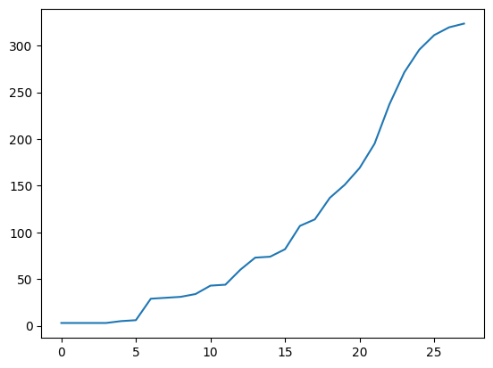

# PyCovid
A ML based model to predict the COVID-19 growth using historical data from existing countries

## Attempt 1
First attempt to predict the growth was by using fbProphet. However, since the scale of data was too small, accurate results were
not obtained. A linear increment was predicted, and clearly it was not the case.

## Attempt 2
The second attempt was by using LSTM networks in Tensorflow to predict data. Such a network needed to be trained first. The WHO
dataset https://covid.ourworldindata.org/data/full_data.csv was used. The dataset consisted of time-series growth rates of various
countries. We tried using the data from China for training. However, it consisted of outliers and the records are available
when the growth was at an advanced stage in China. Therfore the results were not satisfactory.

## Attempt 3
After noticing similar patterns of growth in early stage in various countries, including India, countries like Austria, Czech Republic
were used to train the model. Of them Germany yielded the best results. Loss during training was in ranges of 4.2715e-05and Root Mean Square Error (RMSE) in ranges of 40s. The prediction was spot on.

## Results

LSTM based predictions are not suitable for predicting farther time ranges. I have hereby listed for the next 6 days. 

### The next 6 days (20-03-2020 to 25-03-2020)
Date | Total Cases
------------ | -------------
20-03-2020 | 195
21-03-2020 | 237
22-03-2020 | 272
23-03-2020 | 296
24-03-2020 | 311
25-03-2020 | 320

**If the preventive measures taken were not effective in the last 20 days, the growth will cross 300 within a week**
